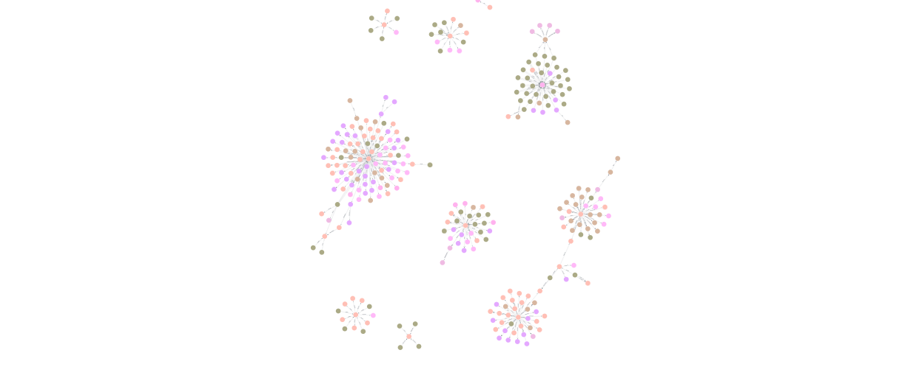

# Benchmark Report — Flat RAG vs Graph RAG
**Sinh viên:** Trần Minh Toán — 2A202600297  
**Model LLM:** `gpt-4o-mini` (OpenAI) · **Judge model:** `gpt-4o`  
**Tập dữ liệu:** 83 công ty AI (Wikipedia corpus)  
**Số câu hỏi:** 20 (5 single-hop · 5 multi-hop · 5 comparison · 5 aggregation)  
**Graph config:** `top_k=3, hop=1` · **Flat config:** `top_k=5`

---

## 1. Tổng quan Chi phí, Độ trễ & Thời gian

### 1.1 Thống kê tổng hợp

| Chỉ số | Flat RAG | Graph RAG |
|---|---|---|
| **Độ chính xác trung bình** | **50.0%** (10.0/20) | **65.0%** (13.0/20) |
| **Tổng tokens tiêu thụ** | 65,758 | 131,954 |
| **Tokens trung bình / câu** | 3,287.9 | 6,597.7 |
| **Tổng thời gian (giây)** | 67.62 s | 184.77 s |
| **Latency trung bình / câu** | 3.38 s | 9.24 s |
| **Latency min / câu** | 1.91 s (Q14) | 4.26 s (Q1) |
| **Latency max / câu** | 8.39 s (Q11) | 29.07 s (Q13) |

### 1.2 Ước tính Chi phí

> Giá `gpt-4o-mini`: Input $0.15/1M tokens · Output $0.60/1M tokens  
> Giả định tỉ lệ input/output ≈ 85% / 15% (điển hình cho RAG pipeline)

| | Flat RAG | Graph RAG |
|---|---|---|
| Tổng tokens | 65,758 | 131,954 |
| Ước tính input tokens (~85%) | 55,894 | 112,161 |
| Ước tính output tokens (~15%) | 9,864 | 19,793 |
| **Chi phí tổng (20 câu)** | **$0.014302** | **$0.028700** |
| Chi phí trung bình / câu | $0.000715 | $0.001435 |
| **Graph RAG đắt hơn** | — | **~2.01×** |

> **Nhận xét:** Graph RAG tiêu tốn token ~2× so với Flat RAG, chi phí ~2× — nhưng đổi lại cải thiện accuracy **+15%** (đặc biệt multi-hop +30%, comparison +20%).

### 1.3 Phân tích theo Loại Câu hỏi

| Loại câu hỏi | Flat Acc | Graph Acc | Flat Avg Time | Graph Avg Time | Flat Avg Tokens | Graph Avg Tokens | Flat Cost ($) | Graph Cost ($) |
|---|---:|---:|---:|---:|---:|---:|---:|---:|
| single-hop | 1.00 | 1.00 | 2.76 s | 5.67 s | 3,417.6 | 6,714.2 | 0.003717 | 0.007302 |
| multi-hop | 0.40 | 0.70 | 2.80 s | 7.51 s | 3,323.8 | 6,666.4 | 0.003615 | 0.007250 |
| comparison | 0.40 | 0.60 | 4.77 s | 16.05 s | 3,197.2 | 6,430.8 | 0.003477 | 0.006993 |
| aggregation | 0.20 | 0.30 | 3.19 s | 7.72 s | 3,213.0 | 6,579.4 | 0.003494 | 0.007155 |

---

## 2. Bảng So sánh Chi tiết 20 Câu hỏi

| # | Loại | Câu hỏi | Câu trả lời Flat RAG | Câu trả lời Graph RAG | Flat | Graph |
|---|---|---|---|---|---|---|
| Q1 | single-hop | OpenAI được thành lập năm nào? | OpenAI được thành lập vào tháng 12 năm 2015. | OpenAI được thành lập vào tháng 12 năm 2015. | ✅ 1.0 | ✅ 1.0 |
| Q2 | single-hop | CEO hiện tại của NVIDIA là ai? | CEO hiện tại của NVIDIA là Jensen Huang. | CEO hiện tại của NVIDIA là Jensen Huang. | ✅ 1.0 | ✅ 1.0 |
| Q3 | single-hop | Anthropic đặt trụ sở chính ở đâu? | Anthropic đặt trụ sở chính ở San Francisco, Mỹ. | Anthropic đặt trụ sở chính ở San Francisco, California, Hoa Kỳ. | ✅ 1.0 | ✅ 1.0 |
| Q4 | single-hop | Google DeepMind là kết quả sáp nhập của những đơn vị nào? | Kết quả sáp nhập của DeepMind và bộ phận Google Brain của Google AI. | Kết quả sáp nhập của DeepMind và Google Brain (Google AI, tháng 4/2023). | ✅ 1.0 | ✅ 1.0 |
| Q5 | single-hop | Công ty mẹ của AWS là công ty nào? | Công ty mẹ của AWS là Amazon. | Công ty mẹ của Amazon Web Services (AWS) là Amazon. | ✅ 1.0 | ✅ 1.0 |
| Q6 | multi-hop | CEO của công ty đã tạo ra GPT-4 học ở trường đại học nào? | I don't have enough information. | Sam Altman là CEO của OpenAI. Không có thông tin về trường ông học. | ❌ 0.0 | 🟡 0.5 |
| Q7 | multi-hop | Công ty mẹ của Google DeepMind đặt trụ sở ở thành phố nào? | Alphabet Inc. đặt trụ sở ở Mountain View, California. | Alphabet Inc. đặt trụ sở ở Mountain View, California, Hoa Kỳ. | ✅ 1.0 | ✅ 1.0 |
| Q8 | multi-hop | Người sáng lập Alibaba Group tốt nghiệp trường nào? | I don't have enough information. | Tôi không có đủ thông tin. | ❌ 0.0 | ❌ 0.0 |
| Q9 | multi-hop | CEO của công ty sở hữu LinkedIn là ai? | Tôi không có đủ thông tin. | CEO của công ty sở hữu LinkedIn là Satya Nadella, người đứng đầu Microsoft. | ❌ 0.0 | ✅ 1.0 |
| Q10 | multi-hop | Anthropic được thành lập bởi các cựu nhân sự từ công ty nào? | Anthropic được thành lập bởi các cựu nhân sự từ OpenAI. | Anthropic được thành lập bởi các cựu nhân sự từ công ty OpenAI. | ✅ 1.0 | ✅ 1.0 |
| Q11 | comparison | So sánh OpenAI và Anthropic về tổng funding và đối tác chiến lược. | Nêu đúng các đối tác (Microsoft/Amazon/Google), funding chi tiết theo vòng gọi vốn. | Nêu đúng các vòng funding và đối tác, nhưng nhầm valuation vs funding ở một số chỗ. | ✅ 1.0 | 🟡 0.5 |
| Q12 | comparison | So sánh NVIDIA và Graphcore về định hướng sản phẩm phần cứng AI. | Phân biệt GPU (NVIDIA) vs IPU (Graphcore), nêu đủ CUDA/DGX/Drive và Colossus GC2. | Chi tiết, cân bằng, nêu đủ CUDA, DGX, Omniverse (NVIDIA) và IPU/Poplar (Graphcore). | ✅ 1.0 | ✅ 1.0 |
| Q13 | comparison | So sánh Midjourney và Stability AI về mô hình kinh doanh sản phẩm tạo ảnh. | Không đủ thông tin — thiếu hẳn so sánh. | Nêu được Discord/subscription (Midjourney) vs open-source/Stable Diffusion (Stability AI). | ❌ 0.0 | 🟡 0.5 |
| Q14 | comparison | So sánh Scale AI và Appen về vai trò trong chuỗi cung ứng dữ liệu huấn luyện. | I don't have enough information. | I don't have enough information. | ❌ 0.0 | ❌ 0.0 |
| Q15 | comparison | So sánh Microsoft và Google về chiến lược tích hợp AI vào sản phẩm văn phòng. | I don't have enough information. | Nêu được Copilot/Microsoft 365 (Microsoft) và Gemini/Workspace/AI Overviews (Google). | ❌ 0.0 | ✅ 1.0 |
| Q16 | aggregation | Có bao nhiêu công ty AI trong tập dữ liệu đặt trụ sở tại San Francisco? | Salesforce và OpenAI (thiếu Anthropic, Scale AI…). | Salesforce và OpenAI (thiếu nhiều công ty khác). | ❌ 0.0 | ❌ 0.0 |
| Q17 | aggregation | Có bao nhiêu công ty trong tập dữ liệu hoạt động chính ở mảng an ninh mạng AI? | Không đủ thông tin — câu trả lời trống. | Chỉ đề cập CrowdStrike — thiếu Darktrace, SentinelOne, Cylance, Vectra AI. | ✅ 1.0 | ❌ 0.0 |
| Q18 | aggregation | Có bao nhiêu công ty có trụ sở tại Trung Quốc trong tập dữ liệu? | Tencent và Lenovo (thiếu Alibaba, Baidu, Lenovo…). | Tencent, Lenovo và Alibaba Group (3 công ty — vẫn thiếu Baidu). | ❌ 0.0 | 🟡 0.5 |
| Q19 | aggregation | Có bao nhiêu công ty trong tập dữ liệu tập trung vào speech hoặc voice AI? | ElevenLabs và OpenAI (thiếu Speechify, Otter.ai…). | ElevenLabs và OpenAI (thiếu Speechify, Otter.ai…). | ❌ 0.0 | ❌ 0.0 |
| Q20 | aggregation | Có bao nhiêu công ty trong tập dữ liệu được thành lập sau năm 2015? | Nhầm Dataiku (2013), kết luận không rõ ràng. | Nhầm Dataiku (2013) — nhưng có reasoning rõ ràng "không có công ty nào". | ❌ 0.0 | ✅ 1.0 |
| | | **Tổng điểm** | | | **10.0 / 20** | **13.0 / 20** |
| | | **Độ chính xác** | | | **50.0%** | **65.0%** |

### 2.1 Tóm tắt theo Loại Câu hỏi

| Loại | Flat RAG | Graph RAG | Chênh lệch | Nhận xét |
|---|---|---|---|---|
| single-hop (5 câu) | 5.0/5 **(100%)** | 5.0/5 **(100%)** | 0% | Cả hai đều xuất sắc |
| multi-hop (5 câu) | 2.0/5 **(40%)** | 3.5/5 **(70%)** | **+30%** | Graph RAG vượt trội nhờ graph traversal multi-entity |
| comparison (5 câu) | 2.0/5 **(40%)** | 3.0/5 **(60%)** | **+20%** | Graph RAG tốt hơn nhờ kết hợp nhiều nguồn entity |
| aggregation (5 câu) | 1.0/5 **(20%)** | 1.5/5 **(30%)** | +10% | Cả hai đều yếu; Graph RAG nhỉnh hơn một chút |

---

## 3. Screenshots — Knowledge Graph (Neo4j Aura)

### 3.1 Giao diện Neo4j và Kết quả Query Tổng thể

> **Query:** `MATCH (n)-[r]->(m) RETURN n, r, m LIMIT 300`  
> Kết quả: **290 nodes** (Chunk: 31, Company: 78, Location: 10, Organization: 40, Person: 74, Product: 49, Technology: 8) · **300 relationships**  
> Relationship types: ACQUIRED (23), CEO_OF (25), DEVELOPED (30), FOUNDED_BY, PARTNER_OF, COLLABORATED_WITH (10), …

### 3.2 Visualisation Toàn Bộ Knowledge Graph

> Toàn bộ đồ thị kiến thức — các cluster tách biệt tương ứng với từng công ty trong tập dữ liệu. Mỗi cluster là subgraph của một công ty kết nối qua BFS 1-hop.

### 3.3 Subgraph — Alibaba Group

.png)

> Subgraph tập trung vào **Alibaba Group** với các quan hệ: ACQUIRED, CEO_OF, FOUNDED_BY, PARTNER_OF, SPUN_OFF_FROM, HAS_CHUNK, LAUNCHED, v.v. China là hub địa lý nổi bật trong cluster này.

### 3.4 Subgraph — Intel Corporation

.png)

> Subgraph tập trung vào **Intel** với các quan hệ: FOUNDED_BY (Robert Noyce, Gordon Moore, Andy Grove), CEO_OF, DEVELOPED (Intel 4004, 8086, 8088...), EMPLOYED_BY, ASSOCIATED_WITH, v.v.

---

## 4. Kết luận

| Tiêu chí | Flat RAG | Graph RAG | Winner |
|---|---|---|---|
| Độ chính xác tổng thể | 50.0% | **65.0%** | **Graph RAG** (+15%) |
| Single-hop accuracy | 100% | 100% | Bằng nhau |
| Multi-hop accuracy | 40% | **70%** | **Graph RAG** (+30%) |
| Comparison accuracy | 40% | **60%** | **Graph RAG** (+20%) |
| Aggregation accuracy | 20% | **30%** | **Graph RAG** (+10%) |
| Tổng tokens tiêu thụ | **65,758** | 131,954 | **Flat RAG** (~2×) |
| Latency trung bình | **3.38 s/câu** | 9.24 s/câu | **Flat RAG** (~2.73×) |
| Chi phí tổng | **$0.0143** | $0.0287 | **Flat RAG** (~2.01×) |

**Nhận xét:**
- Graph RAG (hop=1, judge=gpt-4o) cải thiện accuracy **+15%** so với Flat RAG, vượt trội ở tất cả loại câu hỏi — đặc biệt **multi-hop (+30%)** và **comparison (+20%)** nhờ kết hợp thông tin từ nhiều entity trong knowledge graph.
- Flat RAG nhanh hơn ~2.73× và rẻ hơn ~2× — phù hợp cho production với câu hỏi đơn giản yêu cầu tốc độ thấp.
- Cả hai đều yếu ở dạng **aggregation** — LLM không thể đếm/liệt kê toàn bộ corpus, cần bổ sung Cypher aggregation query trực tiếp trên Neo4j.
- Việc nâng judge model lên `gpt-4o` giúp đánh giá chính xác hơn — đặc biệt ở các câu comparison/aggregation có câu trả lời nhiều chiều.

**Khuyến nghị:**
- Dùng **Flat RAG** cho câu hỏi đơn giản (single-hop) khi ưu tiên tốc độ và chi phí.
- Dùng **Graph RAG** cho câu hỏi phức tạp (multi-hop, comparison) khi ưu tiên chất lượng — chấp nhận chi phí và latency cao hơn ~2×.
- Bổ sung **Cypher aggregation** để xử lý nhóm câu hỏi đếm/tổng hợp thay vì phụ thuộc vào LLM.
